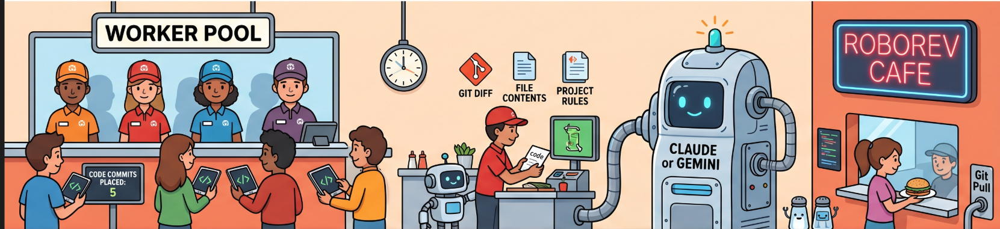
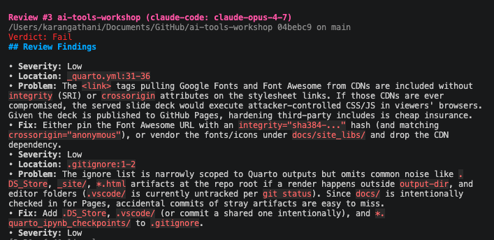
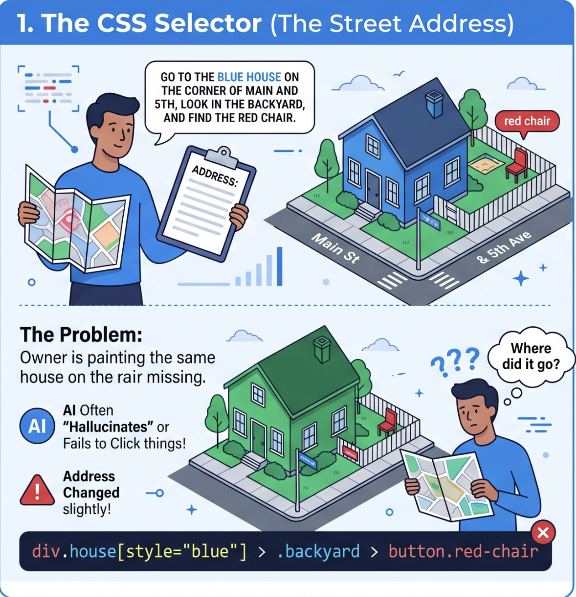
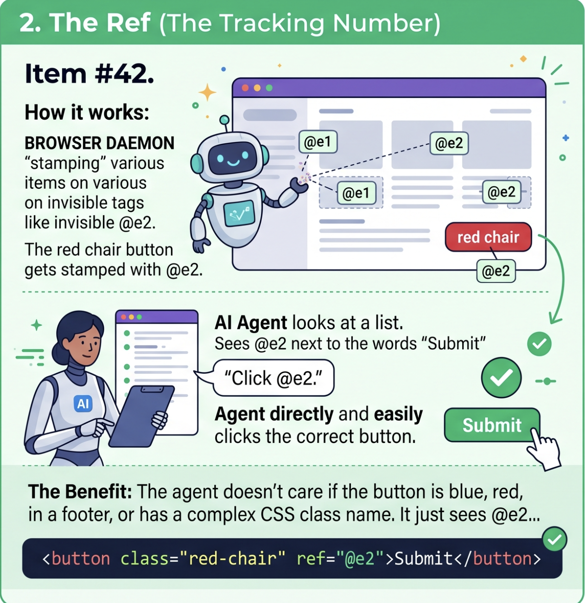

## What You Will Leave With

<div class="kicker"><i class="fa-solid fa-route"></i> Workshop outcome</div>

:::: {.grid-3}
::: {.tool-card}
<div class="card-icon roborev"><i class="fa-solid fa-code-commit"></i></div>

### Review Loop

Use RoboRev to catch agent-written code issues while the work is still fresh.
:::

::: {.tool-card}
<div class="card-icon"><i class="fa-solid fa-window-maximize"></i></div>

### Browser Loop

Use Agent Browser to navigate, inspect, click, type, and verify through compact refs.
:::

::: {.tool-card}
<div class="card-icon gold"><i class="fa-solid fa-repeat"></i></div>

### Combined Loop

Decide when to review code, when to automate the browser, and when to turn findings into durable tests.
:::
::::

::: {.hero-line}
The goal is a tight agent workflow: commit small, review fast, inspect the browser.
:::

## The Combined Development Loop

<div class="kicker"><i class="fa-solid fa-diagram-project"></i> How the pieces fit</div>

<div class="flow-row">
<div class="flow-step roborev"><i class="fa-solid fa-wand-magic-sparkles"></i><strong>Ask the agent</strong><span>Implement a small feature or fix.</span></div>
<div class="flow-step roborev"><i class="fa-solid fa-code-commit"></i><strong>Commit small</strong><span>RoboRev hook queues a review.</span></div>
<div class="flow-step roborev"><i class="fa-solid fa-list-check"></i><strong>Scan findings</strong><span>TUI, CLI, or agent skill.</span></div>
<div class="flow-step"><i class="fa-solid fa-window-maximize"></i><strong>Verify in browser</strong><span>Agent Browser snapshots the app.</span></div>
<div class="flow-step"><i class="fa-solid fa-rotate-right"></i><strong>Fix and repeat</strong><span>Keep context, tests, and commits aligned.</span></div>
</div>

<div class="badge-row"><span class="badge roborev">RoboRev = code review</span><span class="badge browser">Agent Browser = page interaction</span><span class="badge">Small commits make both better</span></div>

## Section 1: RoboRev {.section-slide .roborev-section}

<div class="kicker"><i class="fa-solid fa-code-commit"></i> Section 1</div>

RoboRev keeps agent-generated code reviewable after every commit, without forcing you to stop your flow.

## RoboRev In One Sentence

<div class="kicker"><i class="fa-solid fa-message"></i> Core idea</div>

:::: {.grid-2}
::: {.hero-line}
RoboRev is a persistent review queue for agent-written code. It reviews commits in the background and keeps findings open until you address or close them.
:::

::: {.card}
<h3>Use it when</h3>

- Your coding agent is moving faster than your review bandwidth.
- You want feedback while the agent still has task context.
- You want a durable ledger of findings instead of a one-time chat note.
:::
::::

## Why Reviews Need A Queue

:::: {.grid-3}
::: {.tool-card}
<div class="card-icon roborev"><i class="fa-solid fa-forward-fast"></i></div>

### Agents Move Fast

By the time you manually inspect code, the agent may already be solving the next problem.
:::

::: {.tool-card}
<div class="card-icon roborev"><i class="fa-solid fa-layer-group"></i></div>

### Findings Stack Up

Small issues become expensive when they hide inside a large final diff.
:::

::: {.tool-card}
<div class="card-icon roborev"><i class="fa-solid fa-memory"></i></div>

### Context Decays

Immediate review gives the agent a chance to fix the exact thing it just changed.
:::
::::

## The Review Café

<div class="kicker"><i class="fa-solid fa-image"></i> Visual guide</div>



## RoboRev Mental Model

<div class="flow-row">
<div class="flow-step roborev"><i class="fa-solid fa-code"></i><strong>Change</strong><span>Your agent edits the repo.</span></div>
<div class="flow-step roborev"><i class="fa-solid fa-code-commit"></i><strong>Commit</strong><span>The post-commit hook fires.</span></div>
<div class="flow-step roborev"><i class="fa-solid fa-gears"></i><strong>Daemon</strong><span>Review jobs run in the background.</span></div>
<div class="flow-step roborev"><i class="fa-solid fa-table-list"></i><strong>Queue</strong><span>Findings stay open in the ledger.</span></div>
<div class="flow-step roborev"><i class="fa-solid fa-screwdriver-wrench"></i><strong>Fix</strong><span>Copy, skill, CLI, or refine loop.</span></div>
</div>

<div class="callout-strip"><i class="fa-solid fa-circle-info"></i><p>RoboRev is not a merge gate by default. Treat it as a review memory that follows your local commits.</p></div>

## Install And Initialize

:::: {.grid-2}
::: {.grid-cell}
```bash
# macOS / Linux
curl -fsSL https://roborev.io/install.sh | bash

# Windows (PowerShell)
powershell -ExecutionPolicy ByPass -c "irm https://roborev.io/install.ps1 | iex"

# Inside the repository you want reviewed
cd your-repo
roborev init

# Confirm the daemon and queue are healthy
roborev status
```
:::

::: {.card}
<h3>What `roborev init` does</h3>

- Installs a git post-commit hook.
- Starts the background daemon.
- Registers the repo for review jobs.
:::
::::

## Act 1: First Review Loop

::: {.lab-card .roborev}
<h3>Goal</h3>

Create one small agent-authored change, commit it, and find the RoboRev review.
:::

:::: {.grid-2}
::: {.grid-cell}
```bash
roborev init

# Ask your coding agent for a tiny change.
git add .
git commit -m "add small validation change"

roborev status
roborev tui
```
:::

::::


## Reading The Queue

<div class="command-grid">
<div class="command-card"><code>roborev tui</code><span>Open the interactive review browser.</span></div>
<div class="command-card"><code>roborev list --open</code><span>Show currently open reviews.</span></div>
<div class="command-card"><code>roborev show &lt;job_id&gt;</code><span>Read one review from the CLI.</span></div>
<div class="command-card"><code>roborev log &lt;job_id&gt;</code><span>Inspect the agent job log.</span></div>
<div class="command-card"><code>roborev wait --sha HEAD</code><span>Wait for an already queued review.</span></div>
<div class="command-card"><code>roborev close &lt;job_id&gt;</code><span>Mark a review as handled.</span></div>
</div>

<div class="callout-strip"><i class="fa-solid fa-keyboard"></i><p>In the TUI, use arrow keys or `j` and `k` to move, `a` to close, `Enter` to open details, `y` to copy a completed review, and `?` for shortcuts.</p></div>

## Three Fix Paths

:::: {.grid-3}
::: {.tool-card}
<div class="card-icon roborev"><i class="fa-solid fa-copy"></i></div>

### Copy To Agent

Press `y` in the TUI, paste the review into your coding agent, and ask for a focused fix.
:::

::: {.tool-card}
<div class="card-icon roborev"><i class="fa-solid fa-terminal"></i></div>

### Agent Skill

Run `roborev skills install`, then use `/roborev-review [commit]` to request a code review for a commit and `/roborev-fix` to fix all review findings in Claude Code.
:::

::: {.notes}
The recommended roborev workflow is async reviews + TUI, not synchronous reviews in the agent.
:::

::: {.tool-card}
<div class="card-icon roborev"><i class="fa-solid fa-gears"></i></div>

### CLI Fix

Run `roborev fix` for open reviews, or `roborev refine` for an iterative review and fix loop.
:::
::::

## Act 2: Close The Loop

::: {.lab-card .roborev}
<h3>Workflow</h3>

1. Open `roborev tui` and choose one finding.
2. Use one fix path: copy to agent, `/roborev-fix`, or `roborev fix <job_id>`.
3. Run the relevant tests or checks.
4. Commit the fix.
5. Close the review with `roborev close <job_id>` or from the TUI.
:::


## Daily RoboRev Pattern

<div class="grid-4">
<div class="card"><div class="big-number roborev">1</div><p>Ask the agent for one contained change.</p></div>
<div class="card"><div class="big-number roborev">2</div><p>Commit when the change reaches a reviewable state.</p></div>
<div class="card"><div class="big-number roborev">3</div><p>Scan `roborev tui` every few commits or every 20 minutes.</p></div>
<div class="card"><div class="big-number roborev">4</div><p>Feed findings back into the agent while context is still warm.</p></div>
</div>

## RoboRev Command Sheet

:::: {.grid-2}
::: {.grid-cell}
```bash
# Essentials
roborev init
roborev status
roborev tui
roborev list --open
roborev show <job_id>
roborev close <job_id>

# Fixing
roborev skills install
roborev fix
roborev fix <job_id>
roborev refine --max-iterations 5
```
:::

::::

## Config That Matters

:::: {.grid-2}
::: {.grid-cell}
```bash
# See merged config and where values come from
roborev config list --show-origin

# Smoke test available agents
roborev check-agents
```

```toml
# .roborev.toml
post_commit_review = "branch"

review_guidelines = """
Prioritize correctness, security, and missing tests.
Keep suggestions actionable and scoped to the commit.
"""
```
:::

::: {.card}
<h3>Good defaults for teams</h3>

- Commit small enough that a review has one main theme.
- Add local `review guidelines` (*.roborev.toml*) for recurring project risks.
- Use `--min-severity` when auto-fixing noisy queues.
- Use `roborev compact` when many open findings need consolidation.
:::
::::

## RoboRev Delete

When you no longer need async reviews, run `roborev repo delete [reponame] --cascade` to remove the post-commit hook and stop the daemon

## Configure RoboRev For Claude Code

<div class="kicker"><i class="fa-solid fa-gear"></i> Agent integration</div>

:::: {.grid-2}
::: {.grid-cell}
```toml
# ~/.roborev/config.toml -> Global defaults for all repos
# Default agent when no workflow-specific agent is set.
default_agent = 'claude-code'
default_model = 'claude-sonnet-4-6'
default_backup_agent = ''
default_backup_model = ''

review_reasoning = 'thorough'
refine_reasoning = 'standard'
fix_reasoning = 'standard'
review_agent = 'claude-code'
review_model = 'claude-sonnet-4-6'
```
:::

::: {.grid-cell}
```bash
# Use claude-code by default
export ROBOREV_AGENT=claude-code
```

| Task | Model |
|------|-------|
| **Balanced** | Sonnet 4.6 for daily work |
| **Fast** | Haiku 4.5 for quick lanes |
| **Thorough** | Opus 4.6 for deep dives |
| **Security** | Opus 4.7 for risky code |
| **Design** | Opus 4.7 for architecture |
:::
::::

## RoboRev In Action

<div class="kicker"><i class="fa-solid fa-chart-simple"></i> Example review</div>



## Section 2: Agent Browser {.section-slide .browser-section}

<div class="kicker"><i class="fa-solid fa-window-maximize"></i> Section 2</div>

Agent Browser gives coding agents a compact, text-first way to operate a real browser.

## Agent Browser In One Sentence

:::: {.grid-2}
::: {.hero-line}
Agent Browser is a native CLI for browser automation that returns compact accessibility snapshots with deterministic refs such as `@e1` and `@e2`.
:::

::: {.card}
<h3>Use it when</h3>

- You need quick browser automation from an agent.
- You want page state without dumping the full DOM.
- You need screenshots, form fills, data extraction, or multi-session checks.
:::
::::

## Why Refs Matter

:::: {.grid-3}
::: {.tool-card}
<div class="card-icon"><i class="fa-solid fa-compress"></i></div>

### Context Efficient

A snapshot can describe interactive page state in hundreds of tokens instead of thousands.
:::

::: {.tool-card}
<div class="card-icon"><i class="fa-solid fa-crosshairs"></i></div>

### Deterministic

The agent clicks `@e2`, not the second button it guesses from a screenshot.
:::

::: {.tool-card}
<div class="card-icon"><i class="fa-solid fa-file-lines"></i></div>

### Readable

The agent can reason over text output that names roles, labels, and refs.
:::
::::

## CSS Selectors: The Playwright Way

<div class="kicker"><i class="fa-solid fa-code"></i> Query selectors</div>



## Refs: The Agent Browser Way

<div class="kicker"><i class="fa-solid fa-at"></i> Deterministic references</div>



## Agent Browser Mental Model

<div class="flow-row">
<div class="flow-step"><i class="fa-solid fa-globe"></i><strong>Open</strong><span>Launch or navigate Chrome.</span></div>
<div class="flow-step"><i class="fa-solid fa-camera"></i><strong>Snapshot</strong><span>Capture the accessibility tree.</span></div>
<div class="flow-step"><i class="fa-solid fa-at"></i><strong>Ref</strong><span>Select elements by `@e1` style handles.</span></div>
<div class="flow-step"><i class="fa-solid fa-hand-pointer"></i><strong>Act</strong><span>Click, fill, type, press, select.</span></div>
<div class="flow-step"><i class="fa-solid fa-magnifying-glass"></i><strong>Verify</strong><span>Snapshot or screenshot again.</span></div>
</div>

<div class="callout-strip"><i class="fa-solid fa-server"></i><p>The CLI talks to a native daemon over Chrome DevTools Protocol. The daemon starts automatically and persists between commands.</p></div>

## Install And Smoke Test

:::: {.grid-2}
::: {.grid-cell}
```bash
# Install
npm install -g agent-browser
# or on macOS
brew install agent-browser

# First run downloads Chrome
agent-browser install

# Smoke test
agent-browser open https://example.com
agent-browser snapshot -i
agent-browser close
```
:::

::: {.grid-cell}
```text
- heading "Example Domain" [ref=e1]
- link "More information..." [ref=e2]
```

<div class="callout-strip"><i class="fa-solid fa-terminal"></i><p>Try without installing: `npx agent-browser open example.com`.</p></div>
:::
::::

## Using Agent Browser In Claude Code

<div class="kicker"><i class="fa-solid fa-code"></i> Two ways to use it</div>

:::: {.grid-2}
::: {.grid-cell}
**Option 1: Install the skill (recommended)**

```bash
# One-time setup and select Claude Code as the target agent
npx skills add vercel-labs/agent-browser

# Claude Code now has built-in agent-browser guidance
```

This installs a discovery skill that teaches Claude Code about agent-browser. The skill content auto-updates with your CLI version.
:::

::: {.grid-cell}
**Option 2: Use the CLI directly**

```bash
# In Claude Code terminal
agent-browser open https://example.com
agent-browser snapshot -i
agent-browser click @e1
agent-browser screenshot result.png
agent-browser close
```

Claude Code returns output directly into the conversation. Works without the skill.
:::
::::

## Agent Browser Skills

<div class="kicker"><i class="fa-solid fa-folder"></i> Available skills</div>

<div class="command-grid">
<div class="command-card"><code>core</code><span>Core browser automation: snapshots, forms, screenshots, data extraction, auth.</span></div>
<div class="command-card"><code>dogfood</code><span>Systematic exploratory testing with bug discovery and UX analysis.</span></div>
<div class="command-card"><code>electron</code><span>Automate Electron apps: VS Code, Slack, Discord, Figma, etc.</span></div>
<div class="command-card"><code>slack</code><span>Navigate Slack, check unreads, search, send messages, extract data.</span></div>
<div class="command-card"><code>vercel-sandbox</code><span>Run agent-browser inside ephemeral Vercel Sandbox microVMs.</span></div>
<div class="command-card"><code>agentcore</code><span>Run agent-browser on AWS Bedrock AgentCore cloud browsers.</span></div>
</div>

<div class="callout-strip"><i class="fa-solid fa-terminal"></i><p>After installing, use `agent-browser skills list` to see all available skills, then `agent-browser skills get <name>` to load one into Claude Code.</p></div>

## Lab 3: TodoMVC First Run

::: {.lab-card}
<h3>Goal</h3>

Use Agent Browser to add a todo, verify it appears, and close the browser cleanly.
:::

:::: {.grid-2}
::: {.grid-cell}
```bash
agent-browser open https://demo.playwright.dev/todomvc/
agent-browser snapshot -i

# Find the textbox ref, for example @e1.
agent-browser click @e1
agent-browser type "Buy milk"
agent-browser press Enter
agent-browser snapshot -i
agent-browser close
```
:::

::: {.prompt-box}
Prompt to your coding agent:

Use Agent Browser to add a todo named "Buy milk" at https://demo.playwright.dev/todomvc/. Show each command before running it. Verify the todo appears with a final snapshot.
:::
::::

## Prompting Claude Code For Browser Tasks

<div class="kicker"><i class="fa-solid fa-message"></i> Example prompts</div>

:::: {.grid-2}
::: {.card}
<h3>Simple exploration</h3>

"Use agent-browser to open https://example.com, take a snapshot, and describe what you see. List the clickable elements by their refs."

Claude Code runs commands and reads the snapshot output.
:::

::: {.card}
<h3>Form interaction</h3>

"Use agent-browser to navigate to https://example.com/form, find the email field, type test@example.com, click submit, and show a screenshot."

Claude Code chains commands and maps human language to refs.
:::

::: {.card}
<h3>With the skill</h3>

After installing the skill, Claude Code knows to suggest `agent-browser skills get core` for detailed workflows.

"I need to systematically test my app. What should I use?"

Claude Code will recommend the `dogfood` or `core` skill.
:::

::: {.card}
<h3>Debugging</h3>

"Something broke on the login page. Use agent-browser to open [url], take a screenshot, and describe what you see."

Claude Code provides visual + accessibility tree context.
:::
::::

## Essential Commands

<div class="command-grid">
<div class="command-card"><code>agent-browser open &lt;url&gt;</code><span>Open a page in a browser session.</span></div>
<div class="command-card"><code>agent-browser goto &lt;url&gt;</code><span>Navigate the current page.</span></div>
<div class="command-card"><code>agent-browser snapshot -i</code><span>Print compact page state with refs.</span></div>
<div class="command-card"><code>agent-browser click @e1</code><span>Click a referenced element.</span></div>
<div class="command-card"><code>agent-browser fill @e1 "text"</code><span>Clear and fill a field.</span></div>
<div class="command-card"><code>agent-browser press Enter</code><span>Send a keyboard command.</span></div>
<div class="command-card"><code>agent-browser screenshot page.png</code><span>Save visual evidence.</span></div>
<div class="command-card"><code>agent-browser close</code><span>Close the browser session.</span></div>
</div>

## Pattern: Snapshot, Act, Verify

:::: {.grid-2}
::: {.grid-cell}
```bash
agent-browser snapshot -i
# - textbox "Email" [ref=e1]
# - textbox "Password" [ref=e2]
# - button "Login" [ref=e3]

agent-browser fill @e1 "test@example.com"
agent-browser fill @e2 "password123"
agent-browser click @e3

agent-browser snapshot -i
agent-browser screenshot login-result.png
```
:::

::: {.card}
<h3>Instruction pattern</h3>

1. Ask the agent to snapshot before acting.
2. Make it name the ref it plans to use.
3. Have it verify after every meaningful state change.
4. Save screenshots when visual evidence matters.
:::
::::

## Lab 4: Exploratory Browser Task

::: {.lab-card}
<h3>Scenario</h3>

Test whether TodoMVC renders a script-like todo as text or executes it.
:::

:::: {.grid-2}
::: {.prompt-box}
Prompt to your coding agent:

Use Agent Browser to test TodoMVC with this todo text:
`<script>alert('xss')</script>`

Open the app, snapshot to find the input, add the todo, save a screenshot as xss-test.png, snapshot again, and report whether the text rendered or executed.
:::

::: {.grid-cell}
```bash
agent-browser open https://demo.playwright.dev/todomvc/
agent-browser snapshot -i
agent-browser click @e1
agent-browser type "<script>alert('xss')</script>"
agent-browser press Enter
agent-browser screenshot xss-test.png
agent-browser snapshot -i
agent-browser close
```
:::
::::

## Choosing The Browser Tool

| Need | Agent Browser | Playwright MCP | Playwright Test |
|---|---|---|---|
| One-off browser task | Best | Heavy | Heavy |
| Deep exploratory reasoning | Useful | Best | Limited |
| Repeatable CI suite | Limited | Limited | Best |
| Token efficiency | High | Low | High |
| Multi-browser coverage | Limited | Limited | Best |
| Agent can inspect live page | Best | Best | Indirect |

<div class="small-note">Rule of thumb: use Agent Browser to move quickly, Playwright MCP to reason deeply over live state, and Playwright Test when behavior must become a durable suite.</div>

## Scenario Breakouts

:::: {.grid-2}
::: {.card}
<h3>Pick a tool</h3>

- Build nightly checkout tests across Chrome, Firefox, and WebKit.
- Debug a flaky login flow while watching page state change.
- Extract a table from five sites once and save a CSV.
- Fill a complex internal form from JSON for a one-time migration.
:::

::: {.card}
<h3>Defend the choice</h3>

- What state does the agent need?
- Does the task need to repeat?
- Is token cost a constraint?
- Would a generated test be more valuable than a completed action?
:::
::::

## Agent Browser Troubleshooting

| Symptom | Likely cause | First move |
|---|---|---|
| Ref does not exist | Page changed after snapshot | Run `agent-browser snapshot -i` again |
| Typing misses the field | Focus is elsewhere | Click the field ref before `type` |
| Element is hidden | It is outside view or conditionally rendered | Scroll, wait, or inspect text output |
| Chrome is missing | Browser binary has not been downloaded | Run `agent-browser install` |
| Session confusion | Multiple sessions are open | Use named sessions consistently |

## Capstone: Use Both Tools Together

<div class="kicker"><i class="fa-solid fa-repeat"></i> Final exercise</div>

:::: {.grid-2}
::: {.lab-card .roborev}
<h3>Part A: code loop</h3>

1. Ask the agent to add or adjust one UI behavior.
2. Commit the change.
3. Open RoboRev and inspect the queued review.
:::

::: {.lab-card}
<h3>Part B: browser loop</h3>

1. Use Agent Browser to exercise the changed UI.
2. Save a screenshot or snapshot evidence.
3. Feed both RoboRev findings and browser evidence back into the agent.
:::
::::

<div class="callout-strip"><i class="fa-solid fa-flag-checkered"></i><p>Exit criterion: every participant has completed one full cycle from agent change to commit review to browser verification to fix.</p></div>

## GitHub Pages Deployment

:::: {.grid-2}
::: {.grid-cell}
```bash
# Render the presentation into docs/
quarto render

# Preview locally
quarto preview
```
:::

::: {.card}
<h3>Repository settings</h3>

1. Commit `index.qmd`, `_quarto.yml`, and `styles.scss`.
2. Run `quarto render` before publishing.
3. In GitHub Pages, set the source to the `docs` folder on `main`.
4. Open `https://<owner>.github.io/<repo>/` after the Pages build completes.
:::
::::

<div class="callout-strip"><i class="fa-brands fa-github"></i><p>This project is configured with `output-dir: docs`, so it matches the simplest GitHub Pages deployment path.</p></div>

## Resources

:::: {.grid-2}
::: {.card}
<h3>RoboRev</h3>

- [Quick Start](https://www.roborev.io/quickstart/)
- [CLI Commands](https://www.roborev.io/commands/)
- [Agent Skills](https://www.roborev.io/guides/agent-skills/)
- [GitHub Repository](https://github.com/roborev-dev/roborev)
:::

::: {.card}
<h3>Agent Browser</h3>

- [Docs](https://agent-browser.dev/)
- [GitHub Repository](https://github.com/vercel-labs/agent-browser)
- [Playwright MCP](https://playwright.dev/mcp/introduction)
- [Playwright Test](https://playwright.dev/docs/intro)
:::
::::

::: {.hero-line}
Keep the loop small: change, commit, review, verify, fix. That rhythm is the workshop.
:::
